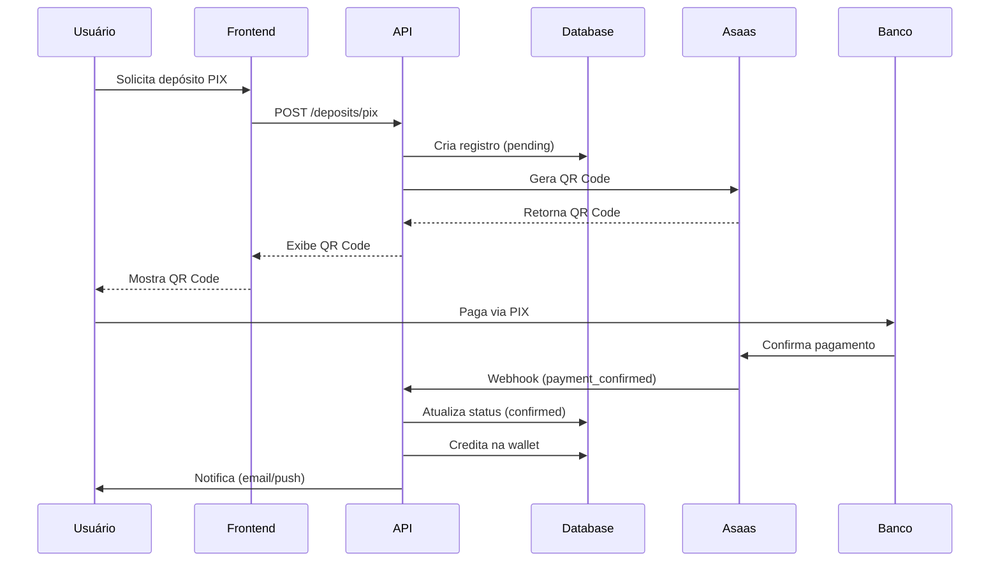
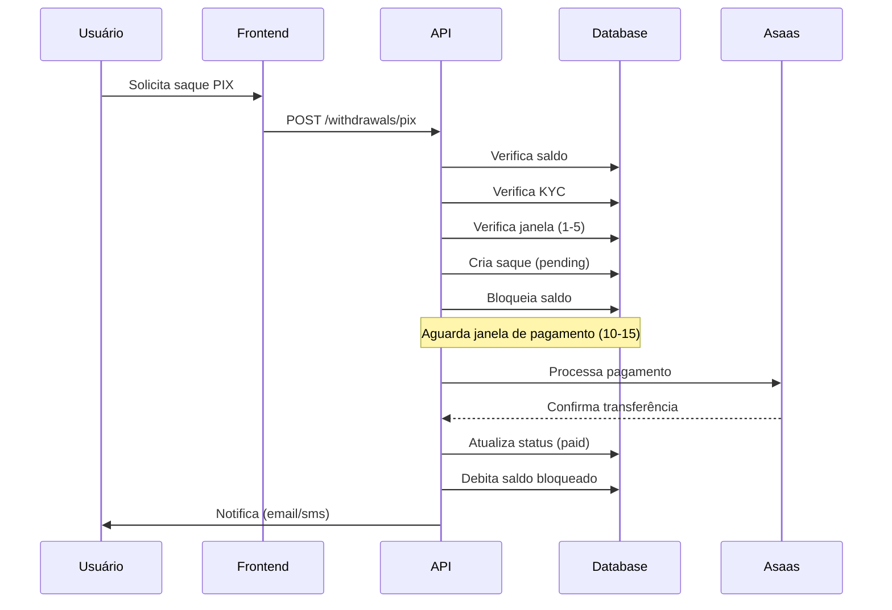
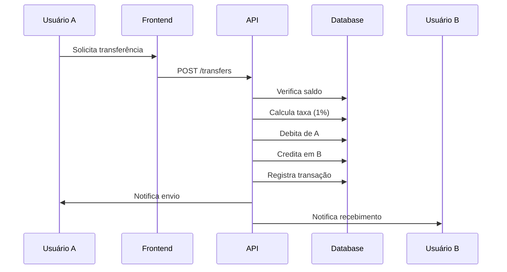

# 🏦 RS WALLETPAY - DOCUMENTAÇÃO COMPLETA

**Versão:** 1.0.0  
**Data:** 06/11/2025  
**Status:** ✅ PRODUÇÃO

---

## 📋 ÍNDICE

1. [Visão Geral](#visão-geral)
2. [Arquitetura](#arquitetura)
3. [Funcionalidades](#funcionalidades)
4. [Métodos de Pagamento](#métodos-de-pagamento)
5. [Fluxos de Operação](#fluxos-de-operação)
6. [API Reference](#api-reference)
7. [Segurança](#segurança)
8. [Integrações](#integrações)
9. [Limites e Taxas](#limites-e-taxas)
10. [Compliance](#compliance)

---

## 🎯 VISÃO GERAL

O **RS WalletPay** é o sistema bancário completo da RS Prólipsi, oferecendo:

- 💰 **Carteira Digital** para cada usuário
- 💳 **Múltiplos métodos** de depósito e saque
- 🔄 **Transferências** internas instantâneas
- 📱 **PIX** integrado via Asaas
- 🔒 **Segurança** de nível bancário
- 📊 **Compliance** total (KYC, AML, PLD)

---

## 🏗️ ARQUITETURA

### Componentes Principais:

```
┌─────────────────────────────────────────────┐
│           RS WALLETPAY SYSTEM               │
├─────────────────────────────────────────────┤
│                                             │
│  ┌──────────────┐      ┌──────────────┐   │
│  │   Wallets    │◄────►│  Deposits    │   │
│  └──────────────┘      └──────────────┘   │
│         │                      │            │
│         │                      │            │
│  ┌──────▼──────┐      ┌───────▼──────┐   │
│  │ Withdrawals │      │  Transfers   │   │
│  └──────────────┘      └──────────────┘   │
│         │                      │            │
│         └──────────┬───────────┘            │
│                    │                        │
│            ┌───────▼────────┐              │
│            │  Transactions  │              │
│            └────────────────┘              │
│                                             │
├─────────────────────────────────────────────┤
│              INTEGRAÇÕES                    │
├─────────────────────────────────────────────┤
│  Asaas API │ PIX │ Cartões │ Boleto        │
└─────────────────────────────────────────────┘
```

### Tabelas do Banco de Dados:

1. **wallets** - Carteiras dos usuários
2. **wallet_deposits** - Depósitos realizados
3. **wallet_withdrawals** - Saques solicitados
4. **wallet_transfers** - Transferências internas
5. **wallet_fees** - Taxas cobradas
6. **wallet_pix_keys** - Chaves PIX cadastradas
7. **wallet_bank_accounts** - Contas bancárias
8. **transactions** - Histórico completo

---

## ⚡ FUNCIONALIDADES

### 1. CARTEIRA DIGITAL

Cada usuário possui uma carteira com:

- **Saldo Disponível**: Valor livre para uso
- **Saldo Bloqueado**: Valor reservado (pedidos, etc)
- **Saldo Total**: Soma dos dois anteriores

```sql
-- Estrutura da Wallet
{
  "id": "uuid",
  "consultor_id": "uuid",
  "saldo_disponivel": 1500.00,
  "saldo_bloqueado": 200.00,
  "saldo_total": 1700.00,
  "limite_saque_diario": 10000.00,
  "limite_saque_mensal": 50000.00
}
```

### 2. DEPÓSITOS

#### Métodos Disponíveis:

| Método | Taxa | Crédito | Limites |
|--------|------|---------|---------|
| **PIX** | 0% | Instantâneo | R$ 10 - R$ 50.000 |
| **Boleto** | R$ 3,50 | 1 dia útil | R$ 50 - R$ 50.000 |
| **Cartão Crédito** | 3,5% | Instantâneo | R$ 20 - R$ 10.000 |
| **Cartão Débito** | 2% | Instantâneo | R$ 10 - R$ 5.000 |

#### Limites Gerais:
- **Diário**: R$ 50.000
- **Mensal**: R$ 200.000
- **Por transação**: R$ 50.000

### 3. SAQUES

#### Métodos Disponíveis:

| Método | Taxa | Tempo | Limites |
|--------|------|-------|---------|
| **PIX** | 2% (mín R$ 2, máx R$ 100) | Instantâneo | R$ 10 - R$ 50.000 |
| **TED/DOC** | R$ 5,00 fixo | 1-2 dias úteis | R$ 50 - R$ 50.000 |

#### Janelas de Operação:
- **Solicitação**: Dia 1 ao 5 de cada mês
- **Pagamento**: Dia 10 ao 15 de cada mês

#### Limites Gerais:
- **Diário**: R$ 10.000
- **Mensal**: R$ 50.000
- **Por transação**: R$ 10.000

#### Requisitos:
- ✅ KYC completo (CPF, RG, Selfie, Comprovante)
- ✅ Chave PIX ou conta bancária cadastrada
- ✅ Saldo disponível suficiente

### 4. TRANSFERÊNCIAS INTERNAS

Entre usuários RS Prólipsi:

- **Taxa**: 1% (mínimo R$ 0, máximo R$ 50)
- **Grátis**: 2 transferências por mês
- **Velocidade**: Instantânea
- **Limites**:
  - Diário: R$ 20.000
  - Mensal: R$ 100.000
  - Por transação: R$ 10.000

---

## 💳 MÉTODOS DE PAGAMENTO

### PIX

#### Características:
- ✅ Instantâneo (24/7)
- ✅ Sem taxas para depósito
- ✅ Taxa de 2% para saque
- ✅ QR Code dinâmico
- ✅ Chave aleatória automática

#### Tipos de Chave:
- CPF/CNPJ
- E-mail
- Telefone
- Chave aleatória

#### Fluxo de Depósito PIX:

```
1. Usuário solicita depósito
2. Sistema gera QR Code via Asaas
3. Usuário paga no banco
4. Webhook confirma pagamento
5. Crédito instantâneo na carteira
```

### BOLETO BANCÁRIO

#### Características:
- Taxa: R$ 3,50
- Validade: 3 dias
- Crédito: 1 dia útil após compensação
- Gerado via Asaas

#### Fluxo:

```
1. Usuário solicita depósito
2. Sistema gera boleto via Asaas
3. Usuário paga em qualquer banco
4. Compensação em 1 dia útil
5. Webhook confirma pagamento
6. Crédito na carteira
```

### CARTÕES

#### Cartão de Crédito:
- Taxa: 3,5%
- Parcelamento: Até 12x
- Valor mínimo por parcela: R$ 20
- Crédito: Instantâneo
- Bandeiras: Visa, Master, Elo, Amex

#### Cartão de Débito:
- Taxa: 2%
- Crédito: Instantâneo
- Bandeiras: Visa, Master

---

## 🔄 FLUXOS DE OPERAÇÃO

### FLUXO 1: Depósito via PIX



### FLUXO 2: Saque via PIX



### FLUXO 3: Transferência Interna



---

## 📡 API REFERENCE

### Endpoints de Depósito

#### POST /api/v1/deposits/pix
Cria depósito via PIX

**Request:**
```json
{
  "amount": 100.00,
  "description": "Recarga de saldo"
}
```

**Response:**
```json
{
  "success": true,
  "deposit_id": "uuid",
  "qr_code": "00020126580014br.gov.bcb.pix...",
  "qr_code_image": "data:image/png;base64,...",
  "expires_at": "2025-11-06T22:00:00Z"
}
```

#### POST /api/v1/deposits/bank-slip
Cria depósito via boleto

**Request:**
```json
{
  "amount": 500.00,
  "description": "Recarga de saldo"
}
```

**Response:**
```json
{
  "success": true,
  "deposit_id": "uuid",
  "bank_slip_url": "https://...",
  "barcode": "34191.79001 01043.510047 91020.150008 1 82880000010000",
  "expires_at": "2025-11-09T23:59:59Z"
}
```

#### POST /api/v1/deposits/credit-card
Cria depósito via cartão de crédito

**Request:**
```json
{
  "amount": 200.00,
  "installments": 3,
  "card": {
    "number": "5162306219378829",
    "holder_name": "JOAO SILVA",
    "expiry_month": "12",
    "expiry_year": "2028",
    "cvv": "123"
  }
}
```

**Response:**
```json
{
  "success": true,
  "deposit_id": "uuid",
  "status": "confirmed",
  "amount": 200.00,
  "fee": 7.00,
  "net_amount": 193.00,
  "installments": 3,
  "installment_value": 66.67
}
```

### Endpoints de Saque

#### POST /api/v1/withdrawals/pix
Solicita saque via PIX

**Request:**
```json
{
  "amount": 500.00,
  "pix_key": "11999887766",
  "pix_key_type": "phone"
}
```

**Response:**
```json
{
  "success": true,
  "withdrawal_id": "uuid",
  "amount": 500.00,
  "fee": 10.00,
  "net_amount": 490.00,
  "status": "pending",
  "estimated_date": "2025-11-10"
}
```

#### GET /api/v1/withdrawals
Lista saques do usuário

**Response:**
```json
{
  "success": true,
  "withdrawals": [
    {
      "id": "uuid",
      "amount": 500.00,
      "fee": 10.00,
      "net_amount": 490.00,
      "method": "pix",
      "status": "paid",
      "requested_at": "2025-11-03T10:00:00Z",
      "paid_at": "2025-11-10T14:30:00Z"
    }
  ],
  "total": 1
}
```

### Endpoints de Transferência

#### POST /api/v1/transfers
Transfere para outro usuário

**Request:**
```json
{
  "to_user_id": "uuid",
  "amount": 100.00,
  "description": "Pagamento de produto"
}
```

**Response:**
```json
{
  "success": true,
  "transfer_id": "uuid",
  "amount": 100.00,
  "fee": 1.00,
  "net_amount": 99.00,
  "status": "completed"
}
```

### Endpoints de Chaves PIX

#### POST /api/v1/pix-keys
Cadastra chave PIX

**Request:**
```json
{
  "key_type": "cpf",
  "key_value": "12345678900"
}
```

**Response:**
```json
{
  "success": true,
  "key_id": "uuid",
  "key_type": "cpf",
  "key_value": "123.456.789-00",
  "is_verified": false
}
```

#### GET /api/v1/pix-keys
Lista chaves PIX do usuário

**Response:**
```json
{
  "success": true,
  "keys": [
    {
      "id": "uuid",
      "key_type": "cpf",
      "key_value": "123.456.789-00",
      "is_active": true,
      "is_verified": true,
      "created_at": "2025-11-01T10:00:00Z"
    }
  ]
}
```

### Endpoints de Wallet

#### GET /api/v1/wallet
Retorna dados da carteira

**Response:**
```json
{
  "success": true,
  "wallet": {
    "balance": 1500.00,
    "blocked_balance": 200.00,
    "available_balance": 1300.00,
    "total_deposits": 5000.00,
    "total_withdrawals": 3500.00,
    "daily_limit": 10000.00,
    "monthly_limit": 50000.00
  }
}
```

#### GET /api/v1/wallet/transactions
Lista transações

**Query Params:**
- `type`: deposit, withdrawal, transfer, bonus
- `status`: pending, confirmed, failed
- `start_date`: 2025-11-01
- `end_date`: 2025-11-30
- `page`: 1
- `limit`: 20

**Response:**
```json
{
  "success": true,
  "transactions": [
    {
      "id": "uuid",
      "type": "deposit",
      "amount": 100.00,
      "fee": 0.00,
      "net_amount": 100.00,
      "status": "confirmed",
      "description": "Depósito via PIX",
      "created_at": "2025-11-06T20:00:00Z"
    }
  ],
  "pagination": {
    "page": 1,
    "limit": 20,
    "total": 150,
    "pages": 8
  }
}
```

---

## 🔒 SEGURANÇA

### KYC (Know Your Customer)

#### Níveis de Verificação:

**Nível 1 - Básico:**
- Documentos: CPF
- Limites: R$ 1.000/dia, R$ 5.000/mês

**Nível 2 - Intermediário:**
- Documentos: CPF, RG, Selfie
- Limites: R$ 5.000/dia, R$ 20.000/mês

**Nível 3 - Avançado:**
- Documentos: CPF, RG, Selfie, Comprovante de endereço
- Limites: R$ 50.000/dia, R$ 200.000/mês

### Anti-Fraude

#### Regras Implementadas:

1. **Rate Limiting**
   - Máximo 10 transações por hora
   - Máximo R$ 10.000 por hora
   - Máximo 5 tentativas falhas por dia

2. **Análise de Risco**
   - Baixo: Auto-aprovado até R$ 1.000
   - Médio: Revisão manual até R$ 5.000
   - Alto: Bloqueio automático

3. **Monitoramento**
   - IPs suspeitos bloqueados
   - Device fingerprinting obrigatório
   - Geolocalização verificada

### Criptografia

- **Em trânsito**: TLS 1.3
- **Em repouso**: AES-256
- **Chaves**: Rotação automática a cada 90 dias
- **Dados sensíveis**: Tokenizados

---

## 🔗 INTEGRAÇÕES

### Asaas API

#### Configuração:

```json
{
  "apiKey": "9de0b2ef-9d5d-462d-87f7-1780650fbdb3",
  "environment": "production",
  "baseUrl": "https://api.asaas.com/v3"
}
```

#### Funcionalidades Utilizadas:

- ✅ Geração de PIX
- ✅ Geração de boletos
- ✅ Processamento de cartões
- ✅ Webhooks de confirmação
- ✅ Transferências bancárias

#### Webhooks:

**URL**: `https://api.rsprolipsi.com.br/webhooks/asaas`

**Eventos:**
- `PAYMENT_RECEIVED` - Pagamento recebido
- `PAYMENT_CONFIRMED` - Pagamento confirmado
- `PAYMENT_OVERDUE` - Pagamento vencido
- `PAYMENT_DELETED` - Pagamento cancelado

### Notificações

#### SendGrid (Email):
- Confirmação de depósito
- Solicitação de saque
- Aprovação de saque
- Extrato mensal

#### Twilio (SMS):
- Códigos de verificação
- Alertas de saque
- Transações de alto valor

#### Firebase (Push):
- Depósito confirmado
- Transferência recebida
- Saldo baixo

---

## 💰 LIMITES E TAXAS

### Resumo Completo:

| Operação | Taxa | Limite Diário | Limite Mensal | Limite/Transação |
|----------|------|---------------|---------------|------------------|
| **Depósito PIX** | 0% | R$ 50.000 | R$ 200.000 | R$ 50.000 |
| **Depósito Boleto** | R$ 3,50 | R$ 50.000 | R$ 200.000 | R$ 50.000 |
| **Depósito Cartão Crédito** | 3,5% | R$ 50.000 | R$ 200.000 | R$ 10.000 |
| **Depósito Cartão Débito** | 2% | R$ 50.000 | R$ 200.000 | R$ 5.000 |
| **Saque PIX** | 2% (R$ 2-100) | R$ 10.000 | R$ 50.000 | R$ 10.000 |
| **Saque TED/DOC** | R$ 5,00 | R$ 10.000 | R$ 50.000 | R$ 10.000 |
| **Transferência Interna** | 1% (máx R$ 50) | R$ 20.000 | R$ 100.000 | R$ 10.000 |

### Taxas Especiais:

- **2 transferências grátis/mês** entre usuários
- **Sem taxa** para depósito via PIX
- **Taxa mínima** de R$ 2 para saque PIX
- **Taxa máxima** de R$ 100 para saque PIX

---

## ⚖️ COMPLIANCE

### Regulamentações Atendidas:

#### 1. Lei Geral de Proteção de Dados (LGPD)
- ✅ Consentimento explícito
- ✅ Direito ao esquecimento
- ✅ Portabilidade de dados
- ✅ Criptografia de dados sensíveis

#### 2. Prevenção à Lavagem de Dinheiro (PLD)
- ✅ KYC obrigatório
- ✅ Monitoramento de transações
- ✅ Relatórios ao COAF
- ✅ Limite de R$ 10.000 para reporte

#### 3. Anti-Money Laundering (AML)
- ✅ Verificação de origem de fundos
- ✅ Análise de padrões suspeitos
- ✅ Bloqueio automático de operações
- ✅ Auditoria completa

#### 4. Banco Central do Brasil
- ✅ Conformidade com PIX
- ✅ Registro de operações
- ✅ Retenção de dados por 7 anos
- ✅ Relatórios regulatórios

### Auditoria:

- **Logs**: Todas as operações registradas
- **Retenção**: 7 anos mínimo
- **Acesso**: Restrito e rastreado
- **Backup**: Diário automático
- **Criptografia**: AES-256

---

## 📊 RELATÓRIOS

### Extrato da Carteira

Gerado automaticamente todo mês e enviado por email.

**Conteúdo:**
- Saldo inicial
- Depósitos do período
- Saques do período
- Transferências enviadas
- Transferências recebidas
- Bônus recebidos
- Taxas cobradas
- Saldo final

**Formatos:** PDF, CSV, Excel

### Dashboard Financeiro

Disponível no painel do usuário:

- Gráfico de evolução do saldo
- Resumo de entradas e saídas
- Maiores transações
- Taxas pagas no mês
- Comparativo mensal

---

## 🚀 PRÓXIMOS PASSOS

### Roadmap:

**Fase 1 - Atual (Concluída):**
- ✅ Depósitos (PIX, Boleto, Cartão)
- ✅ Saques (PIX, TED/DOC)
- ✅ Transferências internas
- ✅ KYC básico
- ✅ Integração Asaas

**Fase 2 - Q1 2026:**
- ⏳ Cartão virtual pré-pago
- ⏳ Cashback automático
- ⏳ Investimentos (CDB, Tesouro)
- ⏳ Empréstimos entre usuários

**Fase 3 - Q2 2026:**
- ⏳ Open Banking
- ⏳ Pagamento de contas
- ⏳ Recarga de celular
- ⏳ Marketplace de serviços

---

## 📞 SUPORTE

### Contatos:

- **Email**: suporte@rsprolipsi.com.br
- **WhatsApp**: +55 11 99999-9999
- **Horário**: Segunda a Sexta, 9h às 18h

### FAQ:

**1. Quanto tempo demora um depósito via PIX?**
R: Instantâneo, em até 1 minuto.

**2. Posso cancelar um saque?**
R: Sim, até o dia 9 do mês (antes da janela de pagamento).

**3. Qual o limite de saque?**
R: R$ 10.000 por dia e R$ 50.000 por mês.

**4. Preciso fazer KYC para depositar?**
R: Não, mas é obrigatório para sacar.

**5. As transferências são instantâneas?**
R: Sim, entre usuários RS Prólipsi são instantâneas.

---

## 📄 CHANGELOG

### v1.0.0 (06/11/2025)
- ✅ Lançamento inicial
- ✅ Depósitos via PIX, Boleto e Cartão
- ✅ Saques via PIX e TED/DOC
- ✅ Transferências internas
- ✅ Integração Asaas
- ✅ KYC básico
- ✅ Anti-fraude

---

## 💛🖤 CONCLUSÃO

O **RS WalletPay** é um sistema bancário completo, seguro e escalável, pronto para atender milhares de usuários simultaneamente.

**Características principais:**
- ✅ Múltiplos métodos de pagamento
- ✅ Segurança de nível bancário
- ✅ Compliance total
- ✅ Integrações robustas
- ✅ API completa
- ✅ Documentação detalhada

**Status:** ✅ PRODUÇÃO  
**Qualidade:** 🟢 EXCELENTE  
**Pronto para:** 🚀 LANÇAMENTO

---

**Documentação gerada em:** 06/11/2025 21:40  
**Versão:** 1.0.0  
**Autor:** RS Prólipsi Tech Team  
**Licença:** Proprietária
